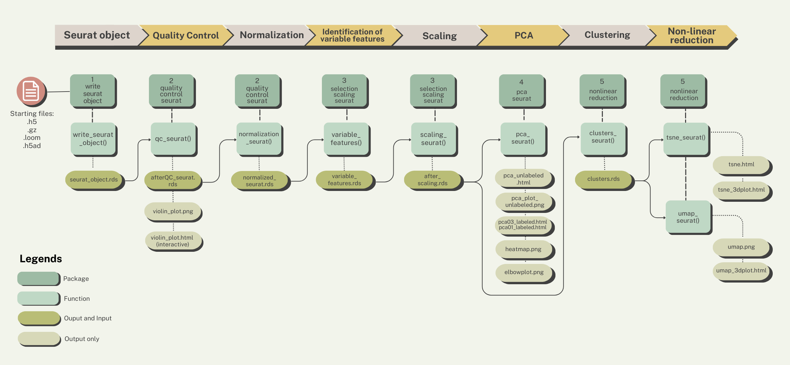

```{r setup, include=FALSE}
all_times <- list()  # store the time for each chunk
knitr::knit_hooks$set(time_it = local({
  now <- NULL
  function(before, options) {
    if (before) {
      now <<- Sys.time()
    } else {
      res <- difftime(Sys.time(), now, units = "secs")
      all_times[[options$label]] <<- res
    }
  }
}))
knitr::opts_chunk$set(
  tidy = TRUE,
  tidy.opts = list(width.cutoff = 95),
  message = FALSE,
  warning = FALSE,
  time_it = TRUE,
  error = TRUE
)
```

> This documents the use of OpenCPU for the pre-processing of scRNA sequences using Seurat v5.

# Pre-processing pipeline

The standard steps of the pre-processing of scRNA sequences are as follows:  The steps are performed separately using their own R functions that can be called individually in OpenCPU. But first let's set up our remote access.

# A. Before running the session

To-dos before we process our file:

-   Set up the remote connection

-   Learn how to use the HTTP methods

-   Learn how to read and access the files

### **Setting up on the browser**

To load OpenCPU on the browser, first determine the local server address. If on Windows, type **ipconfig** or if on Linux, **ifconfig**. It is usually the set of numbers located next to "inet". This will be referred to as "local host".

On your browser, load <http://localhost:8080/ocpu>.

### **HTTP Methods**

OpenCPU uses the HTTP methods **GET** (to retrieve a source) and **POST** (for RPC which is valid if targeting a script or function).

+----------+----------+-----------------+------------------------------------------------------------+
| Method   | Target   | Action          | Example                                                    |
+==========+==========+=================+============================================================+
| **GET**  | object   | read object     | GET /ocpu/library/writeseuratobject                        |
+----------+----------+-----------------+------------------------------------------------------------+
| **POST** | object   | call a function | POST /ocpu/library/writeseuratobject/R/write_seurat_object |
+----------+----------+-----------------+------------------------------------------------------------+
| **GET**  | file     | read a file     | GET /ocpu/library/writeseuratobject/DESCRIPTION            |
|          |          |                 |                                                            |
|          |          |                 | GET /ocpu/library/writeseuratobject/R/write_seurat_object  |
+----------+----------+-----------------+------------------------------------------------------------+

### **API Endpoints**

There pre-processing pipeline for scRNA sequences are available on the server and can be accessed based on the path.

+--------------------------------------------+----------------------------------------------------------+
| Path                                       | What                                                     |
+============================================+==========================================================+
| /ocpu/library/{package name}/              | R packages installed in the global library of the server |
+--------------------------------------------+----------------------------------------------------------+
| /ocpu/library/{package name}/R/{function}/ | Function within the package                              |
+--------------------------------------------+----------------------------------------------------------+
| /ocpu/library/{package name}/DESCRIPTION   | Shows the description/details of the package             |
+--------------------------------------------+----------------------------------------------------------+

### **R Package API**

Any of the /{package}/ libraries support the following endpoints:

+-------------------------+-----------------------------------------------------------------------------+
| Path                    | What                                                                        |
+=========================+=============================================================================+
| ../{package name}/info  | Show information about this package                                         |
+-------------------------+-----------------------------------------------------------------------------+
| ../{package name}/R/    | R objects/scripts exported by this package                                  |
+-------------------------+-----------------------------------------------------------------------------+
| ../{package name}/data/ | Data included in this package                                               |
+-------------------------+-----------------------------------------------------------------------------+
| ../{package name}/man/  | Manuals or help pages included in the package                               |
+-------------------------+-----------------------------------------------------------------------------+
| ../{package name}/html  | Simulates the R-base html help pages                                        |
+-------------------------+-----------------------------------------------------------------------------+
| ../{package name}/\*    | For all else, interfaces to the files in the package installation directory |
+-------------------------+-----------------------------------------------------------------------------+

### **R Object API**

+--------------------------------+-------------------------------------------------------------------------------------------------------------------------------------------------------+
| Path                           | What                                                                                                                                                  |
+================================+=======================================================================================================================================================+
| ../R/                          | Lists R objects in the package or session                                                                                                             |
+--------------------------------+-------------------------------------------------------------------------------------------------------------------------------------------------------+
| ../data/                       | List data objects in a package                                                                                                                        |
+--------------------------------+-------------------------------------------------------------------------------------------------------------------------------------------------------+
| ../R/object                    | Read object in default format. If **object** is a function, it can be called using HTTP POST to run the function or HTTP GET to display the function. |
+--------------------------------+-------------------------------------------------------------------------------------------------------------------------------------------------------+
| ../{R\|data}/{object}/{format} | Retrieve an R object in a particular output format                                                                                                    |
+--------------------------------+-------------------------------------------------------------------------------------------------------------------------------------------------------+

# B. Running a session

Each step of the pipeline have their own functions. These functions can be accessed via their respective packages. A guide on which packages and functions to use are shown below. 

<div style="background-color:lightgray;">
> To perform the quality control step:
>
> > POST ocpu/library/qualitycontrolseurat/R/qc_seurat
>
> where **qualitycontrolseurat** is the package name and **qc_seurat** is the function.

</div>

### **Input, Output: Data and Formats**

These are the extensions of input and output files.

| Format | Content-type  | Notes                                   |
|--------|---------------|-----------------------------------------|
| h5     | list/matrix   | input for the writeseuratobject package |
| gz     | zipped matrix | input for the writeseuratobject package |
| rds    | seurat object | both input and output of packages       |
| png    | image         | output only                             |
| html   | web content   | output only                             |

# C. After running a session

### **R Sessions API**

+---------------------------------------+---------------------------------------------------------------------------------------------------------------------------------------------------------+
| Path                                  | What                                                                                                                                                    |
+=======================================+=========================================================================================================================================================+
| /ocpu/tmp/{key}/                      | List available output for this session                                                                                                                  |
+---------------------------------------+---------------------------------------------------------------------------------------------------------------------------------------------------------+
| /ocpu/tmp/{key}/R                     | R objects stored in this session. Interface using R object API, same as objects in packages                                                             |
+---------------------------------------+---------------------------------------------------------------------------------------------------------------------------------------------------------+
| /ocpu/tmp/{key}/graphics/             | Graphics (plots) stored in this session                                                                                                                 |
+---------------------------------------+---------------------------------------------------------------------------------------------------------------------------------------------------------+
| /ocpu/tmp/{key}/graphics/{n}/{format} | Retrieve plot number **{n}** in output format **{format}**. Format is usually one of **png**, **pdf**, or **svg**. The **{n}** is an integer or "last". |
+---------------------------------------+---------------------------------------------------------------------------------------------------------------------------------------------------------+
| /ocpu/tmp/{key}/source                | Reads the input source code for this session                                                                                                            |
+---------------------------------------+---------------------------------------------------------------------------------------------------------------------------------------------------------+
| /ocpu/tmp/{key}/stdout                | Shows text printed to STDOUT in this session                                                                                                            |
+---------------------------------------+---------------------------------------------------------------------------------------------------------------------------------------------------------+
| /ocpu/tmp/{key}/console               | Shows the console input/output for this session (combines source and stdout)                                                                            |
+---------------------------------------+---------------------------------------------------------------------------------------------------------------------------------------------------------+
| /ocpu/tmp/{key}/zip                   | Download the entire session as a zip archive                                                                                                            |
+---------------------------------------+---------------------------------------------------------------------------------------------------------------------------------------------------------+
| /ocpu/tmp/{key}/tar                   | Download the entire session as a gzipped tarball                                                                                                        |
+---------------------------------------+---------------------------------------------------------------------------------------------------------------------------------------------------------+
| /ocpu/tmp/{key}/files/\*              | Interfaces to the file API in the working dir of the session                                                                                            |
+---------------------------------------+---------------------------------------------------------------------------------------------------------------------------------------------------------+

### **HTTP Status Codes**

The codes returned by OpenCPU

+-----------------+-------------------------------------------------------+--------------------------------------------------------------------+
| HTTP Code       | When                                                  | Returns                                                            |
+=================+=======================================================+====================================================================+
| 200 OK          | On successful GET request                             | Resource content                                                   |
+-----------------+-------------------------------------------------------+--------------------------------------------------------------------+
| 201 Created     | On successful POST request                            | Output location                                                    |
+-----------------+-------------------------------------------------------+--------------------------------------------------------------------+
| 302 Found       | Redirect                                              | Redirect Location                                                  |
+-----------------+-------------------------------------------------------+--------------------------------------------------------------------+
| 400 Bad Request | R raised an error                                     | Error message in **text/plain**                                    |
+-----------------+-------------------------------------------------------+--------------------------------------------------------------------+
| 502 Bad Gateway | Nginx (opencpu-cache) can't connect to OpenCPU server | (Should be resolved by the administrator by looking in error logs) |
+-----------------+-------------------------------------------------------+--------------------------------------------------------------------+
| 503 Bad Request | Serious problem with the server                       | (Should be resolved by the administrator by looking in error logs) |
+-----------------+-------------------------------------------------------+--------------------------------------------------------------------+
