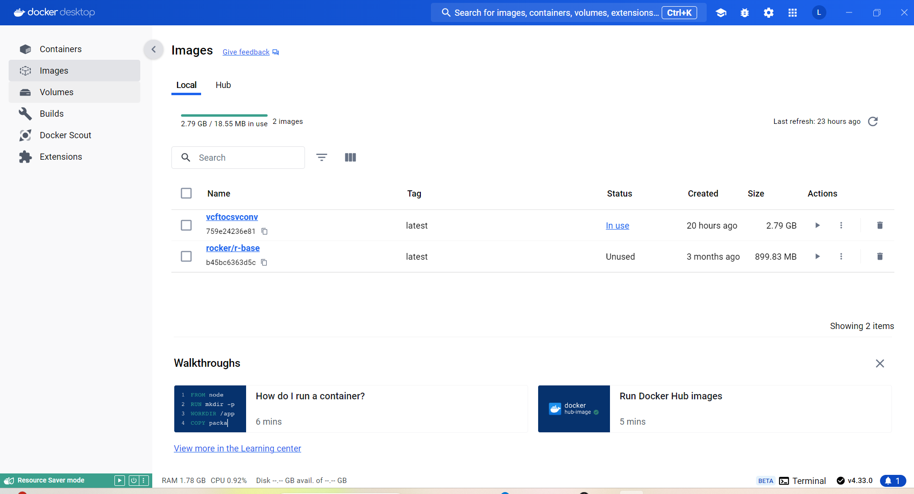
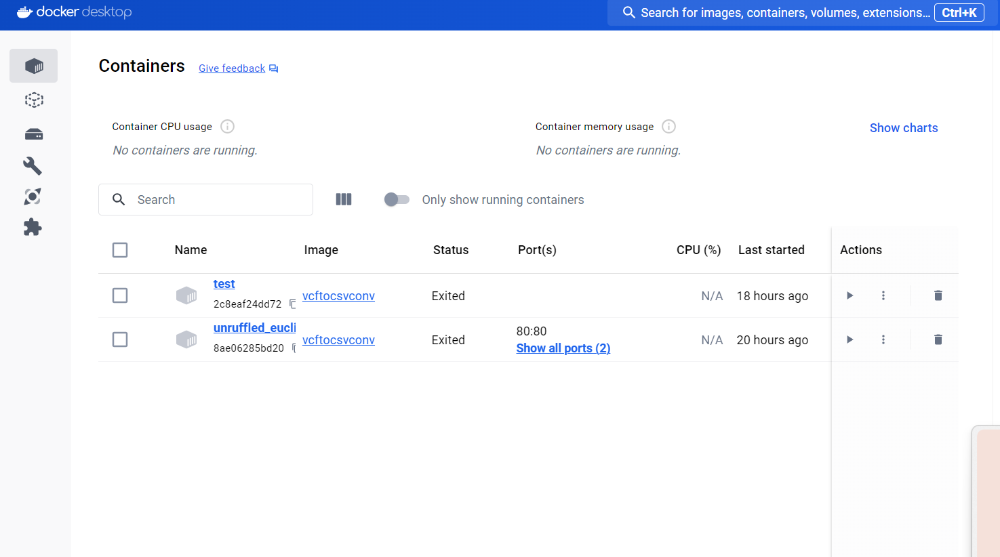

```{r setup, include=FALSE}
knitr::opts_chunk$set(echo = FALSE)
```

# Shiny Server and OpenCPU Server for Dimensional Reduction Applications with an scRNAseq Bioinformatics Pipeline {data-background="img/Copy of QC.png" data-background-size="cover" style="color: white"}

# Outline {data-background="img/Copy of QC.png" data-background-size="cover" style="color: white"}

-   Project Recap

-   Accomplishments

-   Challenges

-   Next Week's to-do

## Project Recap {data-background="img/Copy of QC.png" data-background-size="cover" style="color: white"}

<font size="5">1. Develop and implement a bioinformatics pipeline

-   Deploy RStudio, Shiny, and OpenCPU servers using Docker
    -   Easy development and access: Access of the servers via a browser
        using docker
    -   From git, isolated and standalone applications can be started
        via Docker

2.  Expose a stateless microservice using RESTful API and RPC the major
    steps in scRNAseq pipeline and their visualizations
3.  Develop an interactive dashboard/reactive framework in Shiny for the
    scRNA pre-processing pipeline</font>

# Current Progress {data-background="img/Copy of QC.png" data-background-size="cover" style="color: white"}

------------------------------------------------------------------------

# Successful trial runs {data-background="img/Copy of QC.png" data-background-size="cover" style="color: white"}

---

{width="536"}

---

R package in Docker

<div class="columns-2">



</div>
---


---
```{r echo=FALSE}

source("global.R")


ui <- dashboardPage(
  dashboardHeader(title = 'scRNA Analyzer'),
  dashboardSidebar(
    sidebarMenu(id="tab",
                useShinyjs(),
                menuItem("Homepage", tabName = "home", icon = icon("list")),
                menuItem("Plot scRNAseq", tabName = "input", icon = icon("edit")),
                conditionalPanel(condition = "input.tab == 'input'",
                div(
                    fileInput("file", "Upload File", multiple = FALSE, accept = c(".rds")),
                    actionButton("reset", "Reset", icon = icon("undo"), style = "color: #fff; background-color: #dc3545; width: 87.25%"),
                    actionButton("run", "Run", icon = icon("play"), style = "color: #fff; background-color: #28a745; width: 87.25%")
                    )            )
                )
  ),
  dashboardBody(
    tabItems(
      tabItem(tabName = "input",
              tabsetPanel(id = "main_tabs",
                          tabPanel("Instructions",
                                   includeMarkdown("instructions.Rmd")
                                   )),
              a("Download sample Seurat Object", href = "https://drive.google.com/uc?export=download&id=1IY46LGaVTkakZmwCzKzL4ol9bEQ3R0Z2")),
      tabItem(tabName = "home",
              tags$h1(HTML("--__..--..-- Welcome to scRNAseq Analyzer --..--..__--"))

              )
    )
  )
)

server <- function(input, output, session){
  options(shiny.maxRequestSize = 300*1024^2)

  shinyjs::disable("run")

  observe({
    if (is.null(input$file) != TRUE){
      shinyjs::enable("run")
    } else {
      shinyjs::disable("run")
    }
  })

  observeEvent(input$reset, {
    shinyjs::reset("file")
    shinyjs::disable("run")
  })

  observeEvent(input$run, {
    shinyjs::disable("run")

    show_modal_spinner(text = "Preparing plots...")
    obj <- load_seurat_obj(input$file$datapath)
    if (is.vector(obj)){
      showModal(modalDialog(
        title = "Error with file",
        HTML("<h5>There is an error with the file you uploaded. See below for more details.</h5><br>",
             paste(unlist(obj), collapse = "<br><br>"))
      ))
      shinyjs::enable("run")

    } else {

      output$umap <- renderPlot({
        if (!is.null(input$metadata_col)) {
          create_metadata_umap(obj, input$metadata_col)
        }
      })

      output$featurePlot <- renderPlot({
        if (!is.null(input$gene)) {
          create_feature_plot(obj, input$gene)
        }
      })

      output$downloadFeaturePlot <- downloadHandler(
        filename = function(){
          paste0(input$gene, '_feature_plot', '.png')
        },
        content = function(file){
          plot <- create_feature_plot(obj, input$gene)
          ggsave(filename=file, width = 10, height = 5, type = "cairo")
        }
      )
      output$download_umap <- downloadHandler(
        filename = function(){
          paste0(input$metadata_col, '_UMAP', '.png')
        },
        content = function(file){
          plot <- create_metadata_UMAP(obj, input$metadata_col)
          ggsave(filename=file, width = 10, height = 5, type = "cairo")
        }
      )

      insertTab(
        inputId = "main_tabs",
        tabPanel(
          "UMAP",
          fluidRow(
            column(
              width = 8,
              plotOutput(outputId = 'umap'),
              downloadButton("download_umap", "Download UMAP")
            ),
            column(
              width = 4,
              selectizeInput("metadata_col",
                             "Metadata Column",
                             colnames(obj@meta.data)
              )
            )
          ),
          style = "height: 90%; width: 95%; padding-top: 5%;"
        ),
        select = TRUE
      )
      insertTab(
        inputId = "main_tabs",
        tabPanel(
          "Gene Expression",
          fluidRow(
            column(
              width = 8,
              plotOutput(outputId = 'featurePlot'),
              downloadButton("downloadFeaturePlot", "Download Feature Plot")
            ),
            column(
              width = 4,
              selectizeInput("gene",
                             "Genes",
                             rownames(obj)
              )
            )
          ),
          style = "height: 90%; width: 95%; padding-top: 5%;"
        )
      )

      remove_modal_spinner()
      shinyjs::enable("run")

    }
  })

  # Clear all sidebar inputs when 'Reset' button is clicked
  observeEvent(input$reset, {
    shinyjs::reset("file")
    removeTab("main_tabs", "UMAP")
    removeTab("main_tabs", "Gene Expression")
    shinyjs::disable("run")
  })

}

shinyApp(ui, server)

```


# Challenges {data-background="img/Copy of QC.png" data-background-size="cover" style="color: white"}

-   Deploy the servers using Docker
    -   Containers for the trial package are on private and yet to
        establish a host connection
-   Improve and polish scripts for future deployment
-   
-   
-   

# Next week's to-do {data-background="img/Copy of QC.png" data-background-size="cover" style="color: white"}

-   Attend TechTalk lectures
-   Test run main pipeline for pre-processing of scRNA using Seurat
    package
-   Deploy the step/s of the pipeline using Docker
-   Explore more Dockerfile recipes
